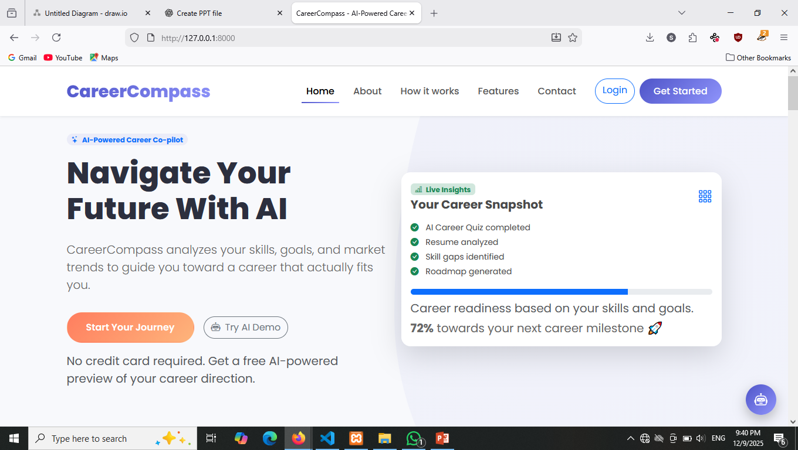
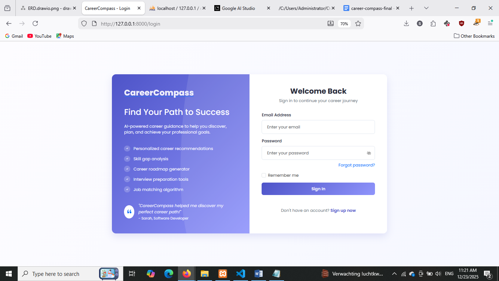
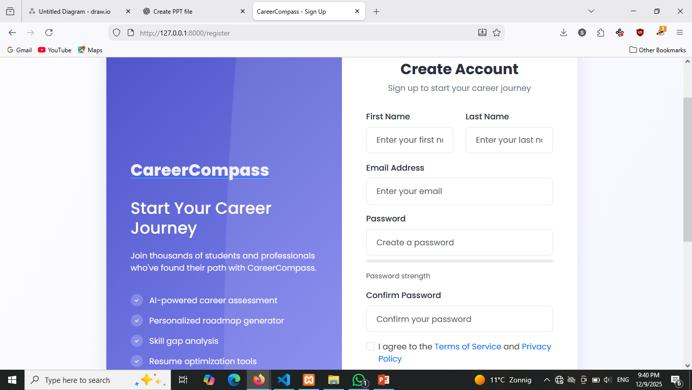
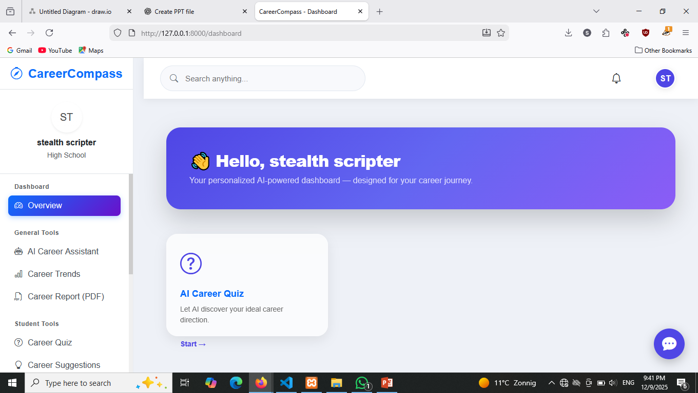
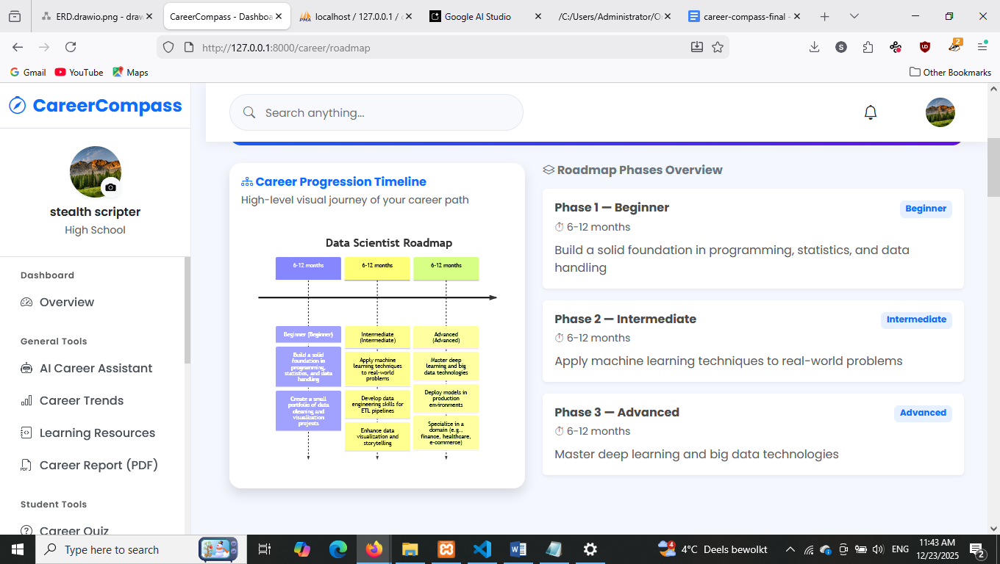
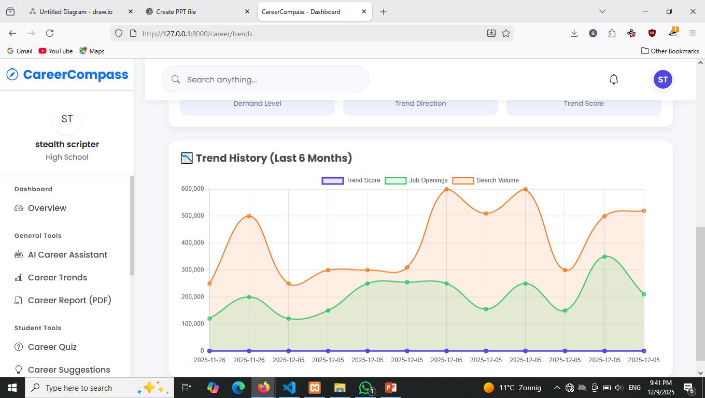

# CareerCompass – AI-Powered Career Guidance System

CareerCompass is a web-based career guidance platform designed to help students and graduates make informed career decisions through AI-driven recommendations. It analyzes user skills, interests, and academic background to generate personalized career insights.

---

## Overview

CareerCompass provides an intelligent recommendation system that assists users in identifying suitable career paths using multiple AI services and structured decision logic.

The system is built with scalability, modularity, and performance in mind, following modern web application architecture principles.

---

## Key Features

- AI-based career recommendation engine
- Personalized career suggestions based on user profile data
- Secure authentication system (login and registration)
- Google OAuth integration
- Dynamic user dashboard
- Multi-provider AI integration (Groq, OpenAI, Gemini, HuggingFace)
- Email notification system
- Queue-based background processing
- Responsive user interface built with Bootstrap
- Modular Laravel architecture with service-based structure

---

## Tech Stack

**Backend:** Laravel (PHP)  
**Frontend:** Blade Templates, Bootstrap  
**Database:** MySQL  
**Authentication:** Laravel Auth, Google OAuth  
**AI Services:** Groq, OpenAI, Gemini, HuggingFace APIs  
**Queue System:** Database Queue  
**Mail Service:** SMTP (Gmail or configurable provider)

---

## System Overview

The system follows a layered architecture:

- User submits profile information (skills, interests, education)
- Data is processed through a service layer
- Multiple AI models generate recommendations
- Results are normalized and ranked
- Final output is displayed on the user dashboard

---

## Architecture

User → Controller Layer → Service Layer → AI Providers → Response Aggregation → UI Layer

---

## Screenshots

### Landing Page

---

### Authentication System

#### Login Page

#### Sign-up Page

---

### User Dashboard

---

### AI Career Engine

#### Career Recommendations

#### Career Trend Analysis

---

## Project Purpose

This project was developed to demonstrate a real-world AI-integrated web application that solves career uncertainty by providing data-driven guidance using multiple AI models.

---

## Future Improvements

- Resume analysis using AI
- Job matching system
- Internship recommendation module
- Advanced analytics dashboard
- Mobile application version

---

## Developer

CareerCompass was developed as a full-stack AI-powered SaaS-style application demonstrating modern Laravel development practices and AI integration workflows.
